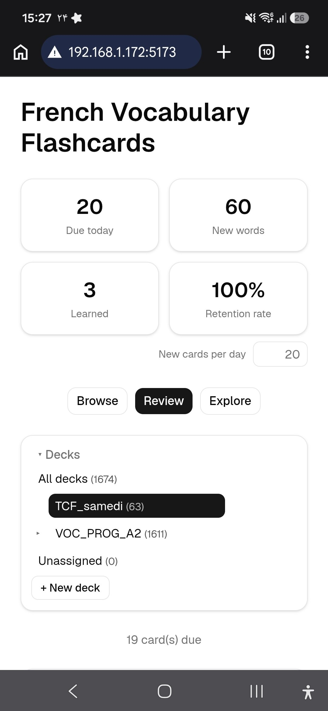
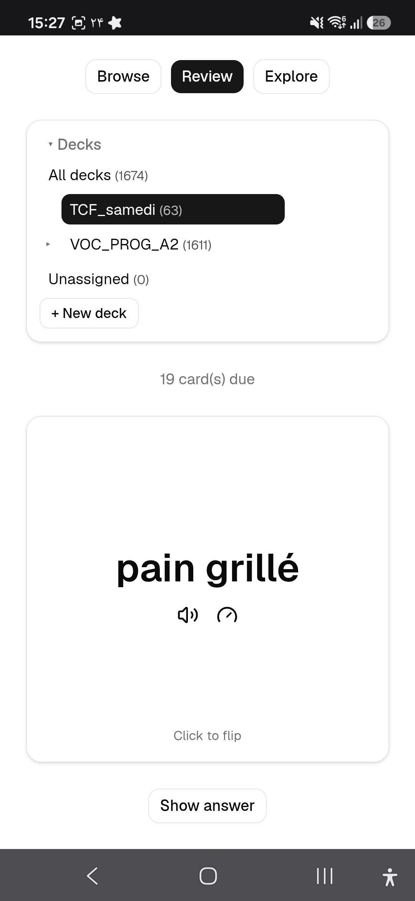
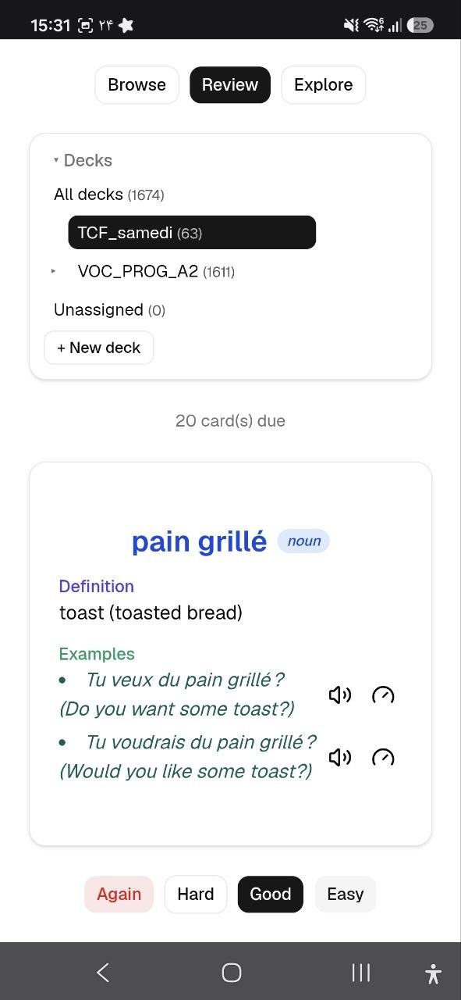

# French Vocabulary Flashcard Reviewer

A browser-based flashcard app for learning French vocabulary, with automatic
dictionary lookups, spaced-repetition review (SM-2), text-to-speech, deck
organization, and Anki import/export.

<table>
  <tr>
    <td></td>
    <td></td>
    <td></td>
  </tr>
</table>

## Features

- **Flashcards** — word, phonetic transcription, part of speech, definition,
  and example sentences.
- **Dictionary lookup** — looks up words on Wiktionary automatically and
  caches results locally.
- **Clickable definitions** — click any word inside a definition or example to
  look it up and add it as a new card.
- **Decks** — organize cards into nested decks (e.g. course chapters).
- **Bulk add** — paste a list of words (one per line, optional leading line
  numbers) and create a card for each, with definitions filled in
  automatically.
- **Review mode** — SM-2 spaced repetition with Again/Hard/Good/Easy ratings
  and a dashboard (due today, new words, learned, retention rate).
- **Sentence explorer** — paste a French sentence and click any word to look
  it up.
- **Text-to-speech** — natural-sounding French pronunciation via Edge neural
  voices.
- **Import/export** — JSON, CSV, and Anki-compatible formats, plus full
  `.apkg` import and JSON backup/restore.

## Tech Stack

- **Frontend**: React, TypeScript, Vite, Tailwind CSS, shadcn/ui (`@base-ui/react`)
- **Backend**: Node.js, Express, TypeScript, Prisma ORM, SQLite

## Getting Started

### Prerequisites

- Node.js (v18+)

### Setup

```bash
# Install dependencies for both frontend and backend
cd backend && npm install
cd ../frontend && npm install
```

The backend uses SQLite via Prisma. On first run, apply migrations:

```bash
cd backend
npx prisma migrate dev
```

### Running

From the project root:

```bash
./run.sh
```

This starts the backend (Express, port 3001) and frontend (Vite, port 5173)
concurrently. Press `Ctrl+C` or run `./stop.sh` to stop both.

Open `http://localhost:5173` in your browser.

### Accessing from your phone

`run.sh` prints a LAN URL (e.g. `http://<your-ip>:5173`) that you can open on
a phone connected to the same Wi-Fi network.

### Standalone offline app (Android/iOS, no laptop required)

For phone use without the laptop running, build the standalone PWA, which
stores all data locally in the browser (IndexedDB) instead of calling the
backend:

```bash
cd frontend
npm run build:standalone
```

With the backend running (`./run.sh`), open `http://<your-ip>:3001/standalone`
on your phone (same Wi-Fi), then "Add to Home Screen" (Chrome menu on Android,
Share menu on iOS Safari). After that one-time install, the app works fully
offline — including review sessions and the SM-2 algorithm.

Notes:

- The standalone app has its own separate data store. Use **Settings → Backup**
  to export a JSON backup from one copy and **restore** it into the other to
  sync data between your laptop and phone "every now and then".
- Anki `.apkg` import isn't available in standalone mode (it requires the
  backend); use CSV/JSON/Anki-TSV import instead.
- Dictionary lookups in standalone mode call Wiktionary/Tatoeba directly from
  the browser and may not work without an internet connection.

## Project Structure

```
backend/    Express API, Prisma schema and migrations, SQLite database
frontend/   React + Vite app
```

### Backend API

| Route                  | Description                                  |
| ----------------------- | --------------------------------------------- |
| `/api/flashcards`      | CRUD, review, due cards, stats, bulk import, import/export |
| `/api/dictionary/:word` | Wiktionary lookup with caching                |
| `/api/decks`           | Deck CRUD (supports nesting via `parentId`)   |
| `/api/tts`             | Text-to-speech audio                          |
| `/api/backup`          | Full JSON backup/restore                      |
| `/api/import-anki`     | Import `.apkg` Anki packages                  |

## Keyboard Shortcuts (Browse/Review)

| Key     | Action       |
| ------- | ------------ |
| Space   | Flip card    |
| →       | Next card    |
| ←       | Previous card |
